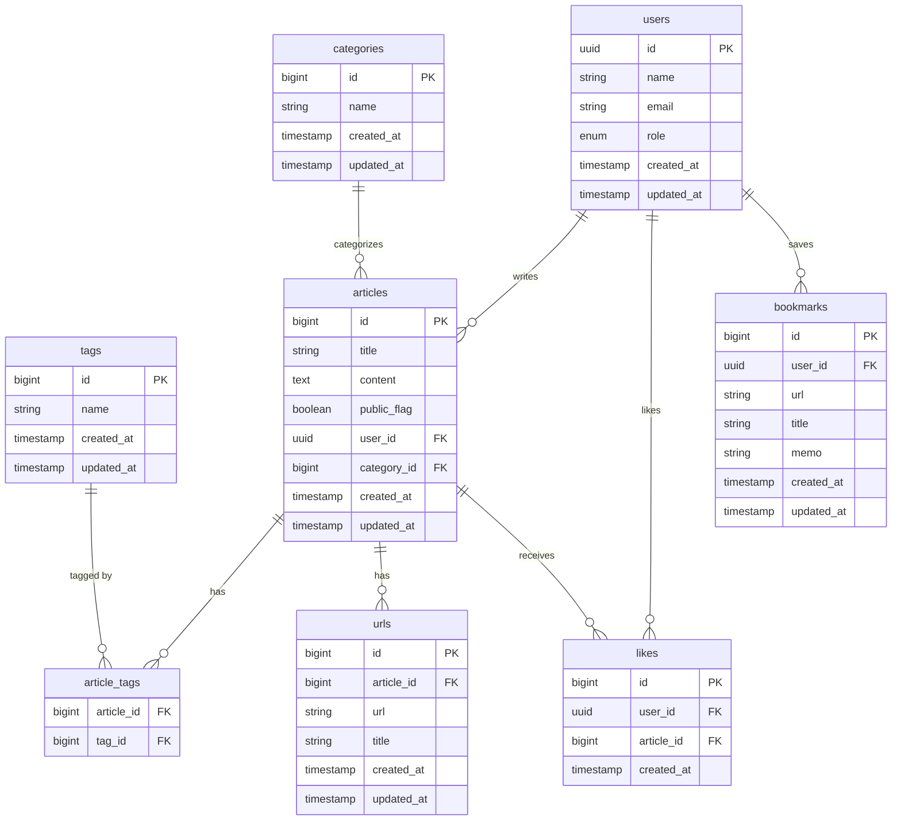

# TechMemo Backend


TechMemoのバックエンドAPIです。
フロントエンドリポジトリ: [techmemo-frontend](フロントのGitHubのURL)

## 使用技術

- Java 21
- Spring Boot 3.x
- Spring Security（JWT認証 / RSA方式）
- Spring Data JPA
- MapStruct
- PostgreSQL


## 主な機能

- ユーザー登録・ログイン（JWT認証）
- 記事の投稿・編集・削除・公開/非公開切り替え
- タグ・カテゴリによる記事の絞り込み検索
- 参考URLの記事への紐付け管理
- いいね機能
- ブックマーク管理

## 設計上の工夫

- JWT認証にRSA方式を採用
  - フロントとバックを分離した構成のためトークン認証を採用
  - HMAC方式と比較して秘密鍵の管理範囲を最小化できるためRSA方式を選択
- アクセストークンとリフレッシュトークンを分離
  - アクセストークンの有効期限を短く設定しリスクを低減
  - リフレッシュトークンはHttpOnly CookieにセットしXSSから保護
- GlobalExceptionHandlerで例外を一元管理
  - RFC 9457準拠のProblemDetail形式でエラーレスポンスを統一
- 記事更新時のURL全件入れ替え設計
  - orphanRemoval=trueを活用しシンプルな実装を実現
- タグのfindOrCreate実装
  - 同時登録時の競合をDataIntegrityViolationExceptionでハンドリング

## 開発背景

最初はThymeleafを使ったサーバーサイドレンダリングで開発しましたが、
フロントとバックエンドを分離した構成の方が責務が明確になると判断し、
React + REST APIの構成に移行しました。
分離するにあたりセッション管理ではなくJWT認証を採用しました。

## ディレクトリ構成
```
src/main/java/com/example/techMemo/
├── article/       # 記事CRUD・検索・公開切り替え
├── auth/          # 認証（登録・ログイン・トークンリフレッシュ）
├── bookmark/      # ブックマーク管理
├── category/      # カテゴリ管理
├── config/        # SecurityConfig・JWTService・RSA設定
├── exception/     # GlobalExceptionHandler・カスタム例外
├── like/          # いいね機能
├── mapper/        # MapStructマッパー
├── tag/           # タグ管理・findOrCreate
├── url/           # 記事に紐づく参照URL管理
└── user/          # ユーザー情報
```
## ER図


## セットアップ

### 必要な環境
- Java 21以上
- PostgreSQL 14以上

### 環境変数
DB_URL=jdbc:postgresql://localhost:5432/techmemo
DB_USERNAME=your_username
DB_PASSWORD=your_password
JWT_EXPIRATION=3600000
JWT_REFRESH_EXPIRATION=604800000

### 起動
```bash
./mvnw spring-boot:run
```

起動時に開発用ダミーデータが自動で投入されます。

## 主なAPIエンドポイント

| メソッド | パス | 説明 | 認証 |
|--------|------|------|------|
| POST | /api/v1/auth/register | ユーザー登録 | 不要 |
| POST | /api/v1/auth/authenticate | ログイン | 不要 |
| POST | /api/v1/auth/refresh-token | トークン更新 | Cookie |
| GET | /api/v1/articles | 公開記事一覧 | 不要 |
| POST | /api/v1/articles | 記事作成 | 必要 |
| GET | /api/v1/articles/me | 自分の記事一覧 | 必要 |
| PATCH | /api/v1/articles/{id}/visibility | 公開/非公開切替 | 必要 |
| POST | /api/v1/articles/{id}/likes | いいね | 必要 |
| GET | /api/v1/bookmarks | ブックマーク一覧 | 必要 |

## デプロイ

| 環境 | URL |
|------|-----|
| バックエンド（Render） | https://techmemo-p29y.onrender.com |
| フロントエンド（Vercel） | https://tadahito-techmemo.vercel.app |
| Swagger UI | https://techmemo-p29y.onrender.com/swagger-ui.html |

## API仕様

Swagger UIで確認できます。
ローカル起動後: http://localhost:8080/swagger-ui.html
